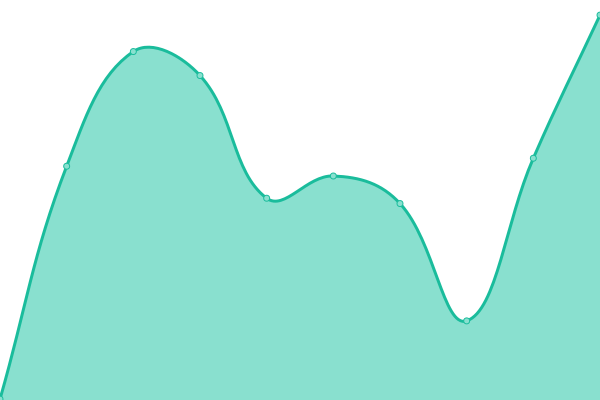

# [📈 Live Status](https://status.hotdish5.com): <!--live status--> **🟩 All systems operational**

This repository contains the open-source uptime monitor and status page for [Griffin Larson](https://griffinlarson.com), powered by [Upptime](https://github.com/upptime/upptime).

With [Upptime](https://upptime.js.org), you can get your own unlimited and free uptime monitor and status page, powered entirely by a GitHub repository. We use [Issues](https://github.com/griffin-larson/server-uptime/issues) as incident reports, [Actions](https://github.com/griffin-larson/server-uptime/actions) as uptime monitors, and [Pages](https://status.hotdish5.com) for the status page.

<!--start: status pages-->
<!-- This summary is generated by Upptime (https://github.com/upptime/upptime) -->
<!-- Do not edit this manually, your changes will be overwritten -->
<!-- prettier-ignore -->
| URL | Status | History | Response Time | Uptime |
| --- | ------ | ------- | ------------- | ------ |
|  [GriffinLarson.com](https://griffinlarson.com) | 🟩 Up | [griffin-larson-com.yml](https://github.com/griffin-larson/server-uptime/commits/HEAD/history/griffin-larson-com.yml) | 

 269ms
     
 | 

<a href="https://status.hotdish5.com/history/griffin-larson-com">87.12%</a>
    

|  [Reverse Proxy](https://proxy.hotdish5.com) | 🟩 Up | [reverse-proxy.yml](https://github.com/griffin-larson/server-uptime/commits/HEAD/history/reverse-proxy.yml) | 

 110ms
     
 | 

<a href="https://status.hotdish5.com/history/reverse-proxy">100.00%</a>
    

|  [Authelia](https://auth.hotdish5.com) | 🟩 Up | [authelia.yml](https://github.com/griffin-larson/server-uptime/commits/HEAD/history/authelia.yml) | 

 113ms
     
 | 

<a href="https://status.hotdish5.com/history/authelia">100.00%</a>
    

|  [Matomo](https://analytics.hotdish5.com) | 🟩 Up | [matomo.yml](https://github.com/griffin-larson/server-uptime/commits/HEAD/history/matomo.yml) | 

 98ms
     
 | 

<a href="https://status.hotdish5.com/history/matomo">100.00%</a>
    

<!--end: status pages-->

[**Visit our status website →**](https://status.hotdish5.com)

## 📄 License

- Powered by: [Upptime](https://github.com/upptime/upptime)
- Code: [MIT](./LICENSE) © [Griffin Larson](https://griffinlarson.com)
- Data in the `./history` directory: [Open Database License](https://opendatacommons.org/licenses/odbl/1-0/)
